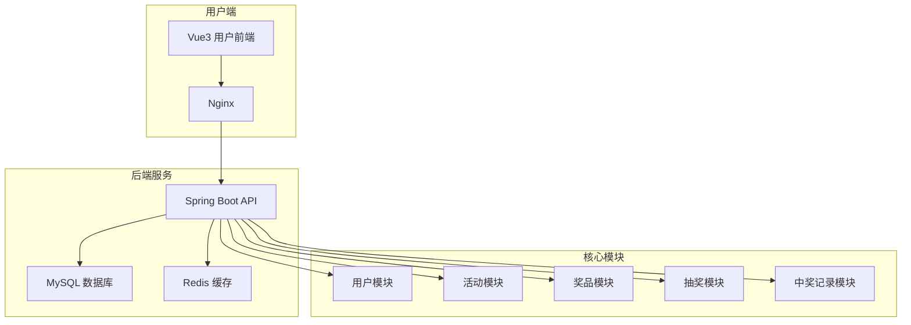
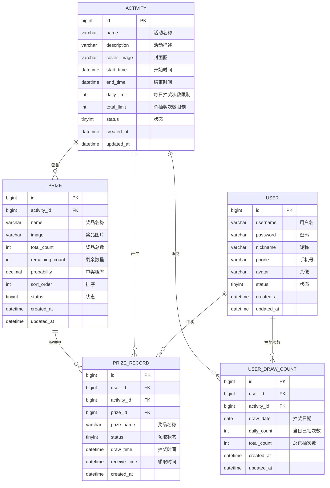

# 抽奖系统设计文档

## 1. 系统架构



## 2. ER 图



## 3. 接口清单

### 3.1 用户模块 (UserController)

| 方法 | 路径 | 描述 |
|------|------|------|
| POST | /api/user/register | 用户注册 |
| POST | /api/user/login | 用户登录 |
| GET | /api/user/info | 获取当前用户信息 |
| PUT | /api/user/update | 更新用户信息 |

### 3.2 活动模块 (ActivityController)

| 方法 | 路径 | 描述 |
|------|------|------|
| GET | /api/activity/list | 获取活动列表 |
| GET | /api/activity/{id} | 获取活动详情 |
| GET | /api/activity/{id}/prizes | 获取活动奖品列表 |

### 3.3 抽奖模块 (DrawController)

| 方法 | 路径 | 描述 |
|------|------|------|
| POST | /api/draw/{activityId} | 执行抽奖 |
| GET | /api/draw/{activityId}/remaining | 获取剩余抽奖次数 |

### 3.4 中奖记录模块 (PrizeRecordController)

| 方法 | 路径 | 描述 |
|------|------|------|
| GET | /api/record/my | 获取我的中奖记录 |
| POST | /api/record/{id}/receive | 领取奖品 |
| GET | /api/record/latest | 获取最新中奖滚动列表 |

## 4. UI/UX 规范

### 4.1 色彩系统

| 用途 | 色值 | 说明 |
|------|------|------|
| 主色调 | #FF6B6B | 红色，喜庆抽奖氛围 |
| 辅助色 | #FFE66D | 金色，奖品高亮 |
| 成功色 | #4ECDC4 | 青色，成功状态 |
| 警告色 | #FFA502 | 橙色，警告提示 |
| 错误色 | #FF4757 | 红色，错误状态 |
| 背景色 | #F8F9FA | 浅灰，页面背景 |
| 卡片背景 | #FFFFFF | 白色，卡片背景 |
| 文字主色 | #2D3436 | 深灰，主要文字 |
| 文字次色 | #636E72 | 中灰，次要文字 |

### 4.2 字体规范

| 用途 | 字号 | 字重 |
|------|------|------|
| 大标题 | 24px | 700 |
| 标题 | 18px | 600 |
| 正文 | 14px | 400 |
| 小字 | 12px | 400 |

### 4.3 间距规范

- 基础单位：8px
- 常用间距：8px / 16px / 24px / 32px
- 卡片内边距：16px
- 卡片圆角：12px
- 按钮圆角：8px

### 4.4 阴影规范

```css
/* 卡片阴影 */
box-shadow: 0 2px 12px rgba(0, 0, 0, 0.08);

/* 悬浮阴影 */
box-shadow: 0 4px 20px rgba(0, 0, 0, 0.12);

/* 按钮阴影 */
box-shadow: 0 2px 8px rgba(255, 107, 107, 0.4);
```

## 5. 技术栈

### 后端
- Spring Boot 3.2.x
- MyBatis-Plus
- MySQL 8.0
- Redis
- JWT 认证
- Lombok
- Validation

### 前端
- Vue 3.4.x
- Vite 5.x
- Pinia
- Vue Router
- Axios
- Element Plus
- SCSS
